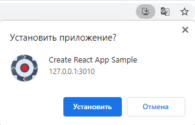
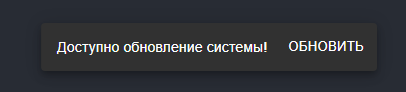
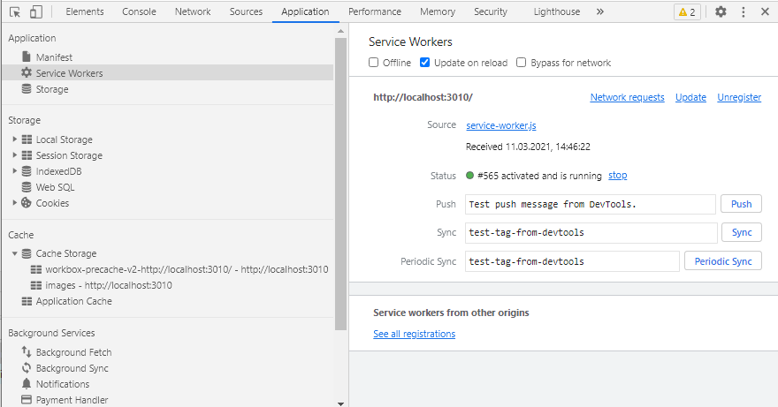
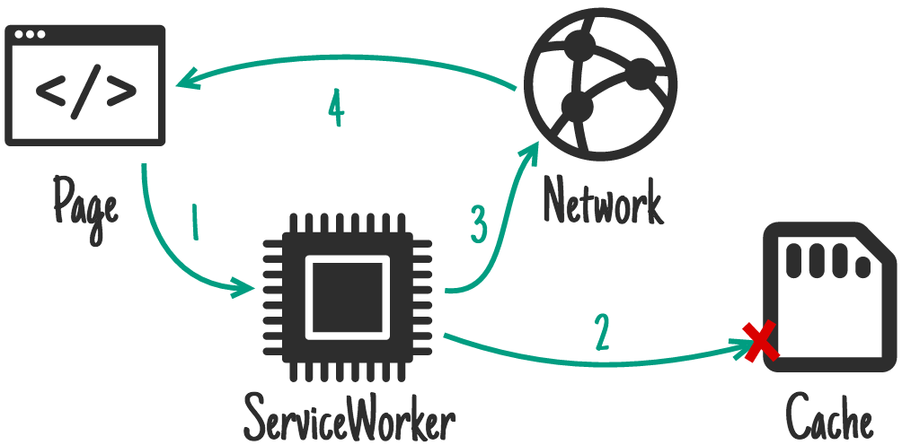

# PWAFast

PWAFast - проект для быстрого внедрения PWA в свои проекты. Структура проекта React + TypeScript + Workbox.

### Установка

```shell
npm install
```

### Запуск

```shell
npm run start-npx
```

Для проверки работоспособности перейти по ссылке http://localhost:3010



Уведомления пользователя о доступности обновления.





### Сгенерировать проект с нуля

https://create-react-app.dev/docs/making-a-progressive-web-app

```shell
# Без TypeScript
npx create-react-app my-app --template cra-template-pwa
# С TypeScript
npx create-react-app my-app --template cra-template-pwa-typescript
```

### Управление кэшированием

https://habr.com/ru/company/domclick/blog/523106/

Зачастую сложно сформировать единую политику кэширования для всех запрашиваемых ресурсов. К примеру, можно себе
позволить кэшировать шрифты на долгий срок и не нагружать сеть запросами, но мы не можем кэшировать запросы, отвечающие
за предоставление актуальных данных, влияющих на бизнес-процесс (например, ипотечную ставку или срок кредитования).
Здесь нам на помощь приходит Workbox, который предлагает тонкую настройку стратегий кэширования, вплоть до каждого
запроса. Разберём особенности работы каждой из них.

#### Network Only

При получении запроса сервис-воркер перенаправляет его в сеть. Кэш не используется.


#### Cache Only

Сервис-воркер формирует ответ на запрос только из кэша. Сеть не используется. Эта стратегия будет полезна, если у вас
используется предварительное кэширование.


#### Network First

В самом начале происходит попытка получить данные из сети. Если получен корректный ответ, то сервис-воркер возвращает
его браузеру, перед этим сохраняя полученные данные в кэш. Если же запрос, направленный в сеть, завершился ошибкой, то
для ответа будут использоваться данные из кэша.


#### Cache First

Согласно этой стратегии, система сперва пытается получить данные из кэша. Если в хранилище ничего не найдено, то запрос
уходит в сеть. При получении успешного ответа кэш обновляется, после чего ответ возвращается браузеру.



#### Stale While Revalidate

Эта стратегия предполагает использование кэшированного ответа на запрос, если он доступен, но при этом уходит фоновый
запрос на обновление кэша из сети. Это наиболее безопасная для пользователя стратегия, потому что она предполагает
регулярное обновление данных кэша. Однако у неё есть недостаток: возникает нагрузка на сеть из-за фоновых запросов за
обновленными данными.


С помощью плагинов можно настроить каждую стратегию посредством дополнительных параметров. Например, добавить имя
сегмента для Cache Storage, выставить сроки времени данных, настроить статусы ответов, которые нужно кэшировать.